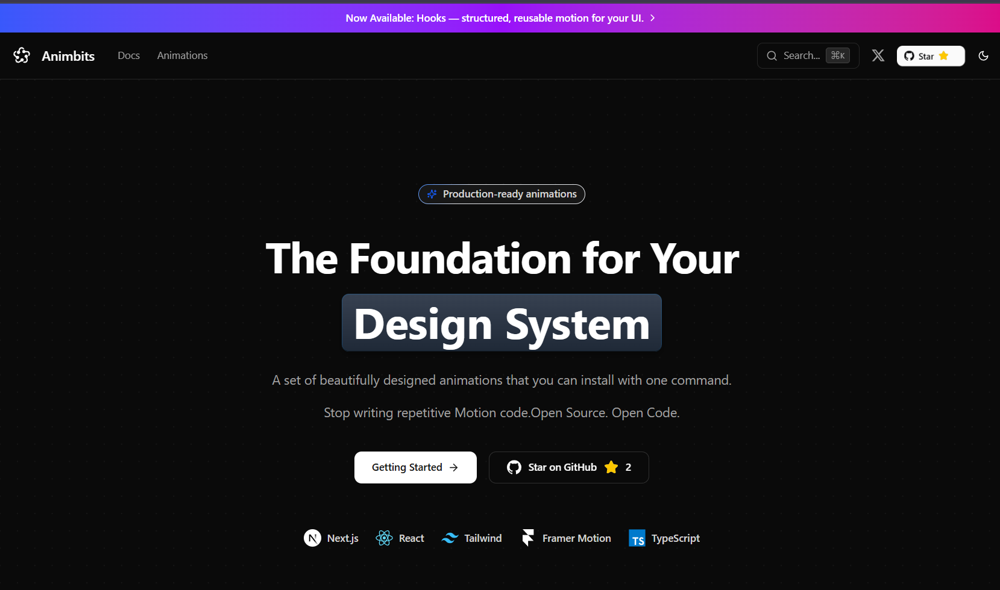

<div align="center">
# AnimBits




### Production-Ready Animation Components for React

A beautifully crafted collection of copy-paste animation components powered by Framer Motion. Install with one command, customize with simple props.

[](https://opensource.org/licenses/MIT)
[](https://www.typescriptlang.org/)
[](https://nextjs.org/)
[](https://www.framer.com/motion/)

[Documentation](https://animbits.dev) · [Browse Components](https://animbits.dev/docs/animations/buttons/lift) · [Report Bug](https://github.com/Garvit1000/AnimBits/issues)

</div>

---

## Features

- **50+ Animation Components** - Icons, buttons, cards, loaders, transitions, and more
- **One-Command Install** - Use the shadcn CLI to add animations instantly
- **Simple Prop API** - Customize animations with intuitive props
- **Zero Config** - Works out of the box with Next.js, Vite, and more
- **Fully Typed** - Built with TypeScript for excellent developer experience
- **Dark Mode Ready** - All animations work seamlessly in light and dark themes
- **Responsive** - Optimized for all screen sizes
- **Accessible** - Respects `prefers-reduced-motion` settings

## Quick Start

### Installation

Install any animation component with a single command:

```bash
npx shadcn add https://animbits.dev/r/buttons-lift.json
```

### Usage

```tsx
import { LiftButton } from "@/components/animations/buttons/lift"

export default function App() {
  return (
    <LiftButton className="px-6 py-3 bg-blue-600 text-white rounded-lg">
      Hover me!
    </LiftButton>
  )
}
```

That's it! No configuration, no setup, just beautiful animations.

## Component Categories

### Icons
Bring your icons to life with smooth, performant animations.

```bash
npx shadcn add https://animbits.dev/r/icons-heartbeat.json
npx shadcn add https://animbits.dev/r/icons-pulse.json
npx shadcn add https://animbits.dev/r/icons-bounce.json
```

**Available:** Heartbeat, Pulse, Bounce, Spin, Wiggle, Shake, Pop, Rotate, Stroke Draw, Fade In, Scale In

### Buttons
Interactive button animations that enhance user experience.

```bash
npx shadcn add https://animbits.dev/r/buttons-ripple.json
npx shadcn add https://animbits.dev/r/buttons-magnetic.json
npx shadcn add https://animbits.dev/r/buttons-glow.json
```

**Available:** Ripple, Magnetic, Glow, Lift, Press, Shine, Border Gradient, Fade In, Slide In

### Cards
Elegant card animations for modern interfaces.

```bash
npx shadcn add https://animbits.dev/r/cards-parallax-tilt.json
npx shadcn add https://animbits.dev/r/cards-hover-glow.json
npx shadcn add https://animbits.dev/r/cards-hover-lift.json
```

**Available:** Parallax Tilt, Hover Glow, Hover Lift, Fade In, Scale In, Slide In, Blur Fade, Grayscale

### Text
Eye-catching text animations and effects.

```bash
npx shadcn add https://animbits.dev/r/text-shimmer.json
npx shadcn add https://animbits.dev/r/text-scramble.json
npx shadcn add https://animbits.dev/r/text-word-carousel.json
```

**Available:** Shimmer, Scramble, Word Carousel, Gradient, Typewriter

### Lists
Staggered animations for list items and grids.

```bash
npx shadcn add https://animbits.dev/r/lists-stagger-fade.json
npx shadcn add https://animbits.dev/r/lists-slide-in.json
```

**Available:** Stagger Fade, Slide In, Scale In, Blur Fade

### Loaders
Beautiful loading indicators for better UX.

```bash
npx shadcn add https://animbits.dev/r/loaders-orbit.json
npx shadcn add https://animbits.dev/r/loaders-morphing.json
npx shadcn add https://animbits.dev/r/loaders-gooey.json
```

**Available:** Orbit, Morphing, Gooey, Dots, Spinner, Pulse, Liquid Progress

### Transitions
Smooth page and theme transitions using View Transitions API.

```bash
npx shadcn add https://animbits.dev/r/transitions-theme-toggle-circular.json
npx shadcn add https://animbits.dev/r/pages-page-transition-fade.json
```

**Available:** Theme Toggle (Circular, Slide), Page Transitions (Fade, Slide)

### Hooks
Reusable animation hooks for custom components.

```bash
npx shadcn add https://animbits.dev/r/hooks-use-hover-lift.json
npx shadcn add https://animbits.dev/r/hooks-use-magnetic.json
```

**Available:** Hover Lift, Hover Glow, Magnetic, Parallax Tilt, Press, Fade In, Scale In, Slide In, and more

## Examples

### Magnetic Button

```tsx
import { MagneticButton } from "@/components/animations/buttons/magnetic"

<MagneticButton 
  strength={0.3} 
  className="px-8 py-4 bg-gradient-to-r from-purple-600 to-pink-600 text-white rounded-full"
>
  Magnetic Effect
</MagneticButton>
```

### Theme Toggle with Circular Ripple

```tsx
import { ThemeToggleCircular } from "@/components/animations/transitions/theme-toggle-circular"
import { useTheme } from "next-themes"

export function ThemeToggle() {
  const { setTheme } = useTheme()
  
  return (
    <ThemeToggleCircular 
      onToggle={() => setTheme(theme === 'dark' ? 'light' : 'dark')}
      speed={0.5}
      blur={0}
    >
      <button>Toggle Theme</button>
    </ThemeToggleCircular>
  )
}
```

### Parallax Tilt Card

```tsx
import { CardParallaxTilt } from "@/components/animations/cards/parallax-tilt"

<CardParallaxTilt tiltMaxAngle={15} glareEnable={true}>
  <div className="p-6 bg-white dark:bg-neutral-900 rounded-xl">
    <h3>Interactive Card</h3>
    <p>Hover to see the 3D tilt effect</p>
  </div>
</CardParallaxTilt>
```

## Development

### Prerequisites

- Node.js 18+ 
- pnpm (recommended) or npm

### Local Setup

```bash
# Clone the repository
git clone https://github.com/Garvit1000/AnimBits.git
cd AnimBits

# Install dependencies
pnpm install

# Build the registry
pnpm registry:build

# Start the development server
pnpm dev
```

The site will be available at `http://localhost:3000`

### Testing Components Locally

```bash
# In your test project
npx shadcn add http://localhost:3000/r/buttons-lift.json
```

## Contributing

Contributions are welcome! Whether it's:

- Bug reports
- Feature requests
- Documentation improvements
- New animation components

Please feel free to open an issue or submit a pull request.

### Adding a New Component

1. Create your component in `registry/new-york/animations/[category]/[name].tsx`
2. Add the component entry to `registry.json`
3. Create documentation in `content/docs/animations/[category]/[name].mdx`
4. Run `pnpm registry:build` to generate the registry files
5. Test locally and submit a PR

## License

MIT © [Garvit Joshi](https://github.com/Garvit1000)

## Acknowledgments

- Built with [Next.js](https://nextjs.org/) and [Tailwind CSS](https://tailwindcss.com/)
- Powered by [Framer Motion](https://www.framer.com/motion/)
- CLI integration via [shadcn/ui](https://ui.shadcn.com/)
- Documentation with [Fumadocs](https://fumadocs.vercel.app/)

---

<div align="center">

**[animbits.dev](https://animbits.dev)** · **[@Garvit1000](https://twitter.com/Garvit1000)**

Made with love for the React community

</div>
